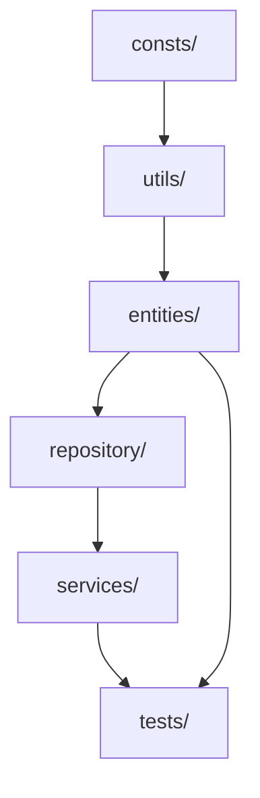

# Sistema de Pontuação de Clientes — TDD, Node.js & Vitest

Este projeto implementa um sistema de gerenciamento de pontos de fidelidade para clientes, focado em qualidade de software com **TDD (Test-Driven Development)**. O objetivo principal é permitir a prática de TDD aplicando testes à camada de negócio, utilizando arquitetura **Repository Pattern**, e operando apenas com dados em memória (sem banco de dados ou interface gráfica).

## 📋 Contexto

Uma empresa precisa de um sistema para calcular e gerenciar pontos de fidelidade dos clientes, conforme regras que podem evoluir. Pontos são acumulados com base em compras, podendo receber bônus ou descontos conforme o perfil do cliente.

## 🎯 Objetivos

- **Praticar TDD:** Testes escritos antes da implementação de cada método
- **Desenvolver métodos testáveis:** Foco na lógica de negócio e manipulação em memória
- **Manutenção e refatoração seguras:** Garantidas por testes automatizados com **100% de cobertura**
- **Aplicar SOLID:** Implementação de SRP (Single Responsibility Principle) e DIP (Dependency Inversion Principle)

## 🛠️ Tecnologias e Requisitos

- **Node.js v22**
- **Vitest / Vitest UI** (framework de testes)
- **Sem banco de dados** — apenas estruturas de dados em memória

## 🚀 Comandos

### Instalação

```bash
npm install
```

### Testes

```bash
npm test              # Executa testes em modo watch
npm run test:ui       # Interface gráfica interativa do Vitest
npm run test:cov      # Gera relatório de cobertura
npm run test:cov:ui   # Abre relatório de cobertura no navegador
```

## 📁 Estrutura do Projeto

O projeto foi organizado seguindo princípios de Repository Pattern, priorizando separação de responsabilidades e rastreabilidade das regras de negócio.

```bash
sistema-de-fidelidade/
├── package.json
├── README.md
├── vitest.config.js
└── src/
    ├── consts/          # Constantes do domínio (tipos, multiplicadores)
    ├── entities/        # Entidades de domínio: Cliente e Carteira
    ├── repository/      # Padrão Repository (persistência em memória)
    ├── services/        # Camada de serviço (orquestração e relatórios)
    ├── utils/           # Funções auxiliares (cálculos, validações, relatórios)
    └── tests/           # Testes unitários (50 testes organizados)
        ├── Cliente.test.js   # 29 testes
        └── Carteira.test.js  # 21 testes
```

### Fluxo de Dependências



## 🏗️ Decisões Arquiteturais

### Modelo de Domínio Pragmático

Embora o projeto tenha sido estruturado inicialmente para um **Rich Domain Model** (onde as entidades encapsulam toda a lógica de negócio), optamos por uma abordagem mais **pragmática e equilibrada**:

#### Por que não um modelo totalmente "rico"?

1. **Complexidade desnecessária**: Para o escopo do projeto, um modelo rico puro exigiria mudanças técnicas que não agregariam valor real
2. **Testabilidade**: A estrutura atual permite testes isolados sem necessidade de abstração excessiva
3. **Manutenibilidade**: Código mais simples e direto facilita compreensão e evolução

#### O que foi implementado?

- **Entidades com lógica**: `Cliente` e `Carteira` possuem métodos de negócio (`registrarCompra`, `resgatarPontos`, etc.)
- **Service layer**: `ClienteService` orquestra operações complexas e relatórios
- **Funções utilitárias**: `utils/` fornece cálculos e validações reutilizáveis
- **Repository**: Abstrai persistência seguindo o padrão Repository

Esta abordagem **equilibra simplicidade com boas práticas**, evitando tanto o [Anemic Domain Model](https://martinfowler.com/bliki/AnemicDomainModel.html) puro quanto a complexidade excessiva de um modelo rico dogmático.

### Princípios SOLID Aplicados

#### ✅ **SRP (Single Responsibility Principle)**

- Cada classe tem funções bem definidas e uma responsabilidade clara:
  - `Carteira`: gerencia pontos
  - `Cliente`: representa o cliente e suas operações
  - `ClienteRepository`: persiste clientes
  - `ClienteService`: orquestra consultas e relatórios

#### ✅ **DIP (Dependency Inversion Principle)**

- `ClienteService` depende de abstrações (aceita qualquer repository via construtor)
- Entities usam funções utilitárias injetáveis (embora importadas diretamente para simplicidade)

## 📊 Organização dos Testes

Os testes foram organizados em **2 arquivos consolidados** com hierarquia clara usando `describe` aninhados:

### `Cliente.test.js` - 29 testes

```
Cliente - Testes Unitários
├── Comportamentos da Entidade Cliente
│   ├── Cálculo de Pontos por Tipo (#1-3) - 3 testes
│   ├── Acúmulo e Consulta (#4-5) - 2 testes
│   ├── Resgate de Pontos (#6-8) - 3 testes
│   ├── Compras e Valores (#9-10) - 2 testes
│   ├── Proteção de Saldo (#11) - 1 teste
│   └── Pontos Iniciais e Bônus (#13-15) - 3 testes
├── Repository e Service - Operações em Lista
│   ├── Busca de Cliente (#12, #21) - 2 testes
│   └── Operações em Lista (#16-20, #22-23) - 7 testes
└── Validações e Regras de Negócio
    ├── Validações do ClienteRepository - 2 testes
    ├── Validações do ClienteService - 1 teste
    ├── Validações de Desconto Promocional - 2 testes
    └── Validações de Tipo de Cliente - 1 teste
```

### `Carteira.test.js` - 21 testes

```
Carteira - Testes Unitários
├── Operações com Pontos
│   ├── Inicialização - 2 testes
│   ├── Adicionar Pontos
│   │   ├── Por Compra (com multiplicador) - 4 testes
│   │   ├── Diretamente (bônus) - 1 teste
│   │   └── Acúmulo de Pontos - 2 testes
│   ├── Resgatar Pontos - 2 testes
│   └── Remover Pontos (Expiração) - 1 teste
└── Validações e Proteções
    ├── Validações de Entrada - 5 testes
    ├── Proteção de Saldo - 2 testes
    └── Integridade do Saldo - 2 testes
```

### Benefícios da Organização

- ✅ **Hierarquia clara e lógica** por funcionalidade/contexto
- ✅ **Fácil navegação** entre testes relacionados
- ✅ **Output legível** nos relatórios de teste
- ✅ **Manutenção simplificada** - encontrar e modificar testes específicos

## 📈 Cobertura de Testes

**Status**: ✅ **100% de cobertura** em statements, functions e lines!


### 23 Testes Obrigatórios

Todos os 23 testes obrigatórios do projeto foram implementados e estão **passando**:

- [x] #1-3: Cálculo de pontos por tipo de cliente (PADRÃO, PREMIUM, VIP)
- [x] #4-5: Acúmulo e consulta de pontos
- [x] #6-8: Resgate de pontos e validações
- [x] #9-11: Validações de compra e proteção de saldo
- [x] #12: Busca de cliente inexistente lança erro
- [x] #13-15: Pontos iniciais, bônus promocional e expiração
- [x] #16-20: Operações em lista (registrar, filtrar, ordenar, remover)
- [x] #21: Buscar cliente por nome
- [x] #22-23: Somar total de pontos e gerar ranking

## 🎮 Regras de Negócio

### Pontuação Base

- **Cliente Padrão**: 1 ponto por R$1 gasto
- **Cliente Premium**: 1,5 pontos por R$1 gasto
- **Cliente VIP**: 2 pontos por R$1 gasto

### Funcionalidades

- Registrar compra (acumula pontos)
- Aplicar desconto promocional em compras
- Consultar total de pontos
- Resgatar pontos para desconto (1 ponto = R$0,05)
- Adicionar pontos de boas-vindas
- Expirar pontos antigos
- Operar sobre listas: filtrar, ordenar, remover, ranking

## 📝 Componentes Principais

### `src/entities/`

Núcleo do domínio. `Cliente` agrega `Carteira`, mantendo baixo acoplamento e permitindo evolução independente.

### `src/repository/`

Implementa o padrão Repository. Abstrai a persistência em memória, centraliza buscas, filtros e ordenações.

### `src/services/`

Camada de orquestração. `ClienteService` coordena operações complexas e geração de relatórios.

### `src/utils/`

Funções puras reutilizáveis:

- `calculos.js`: Cálculos de pontos e descontos
- `validacoes.js`: Validações de entrada
- `relatorios.js`: Funções para relatórios e rankings

### `src/consts/`

Catálogo de constantes do domínio (tipos de cliente, multiplicadores, valores). Serve como "linguagem ubíqua" do projeto.

## 📚 Critérios de Avaliação

| Critério                 | Peso | Status |
| ------------------------ | ---- | ------ |
| Aplicação correta do TDD | 30%  | ✅     |
| Qualidade dos testes     | 25%  | ✅     |
| Coerência da lógica      | 25%  | ✅     |
| Organização do código    | 10%  | ✅     |
| Documentação             | 10%  | ✅     |

## 🔄 (Opcional) Extensões

- Adicionar novas categorias de clientes (Bronze, Prata, Ouro).
- Criar regras de expiração de pontos mais complexas.
- Desenvolver operações adicionais sobre listas (ranking dinâmico, busca por intervalo de
  pontos, merge de listas).
