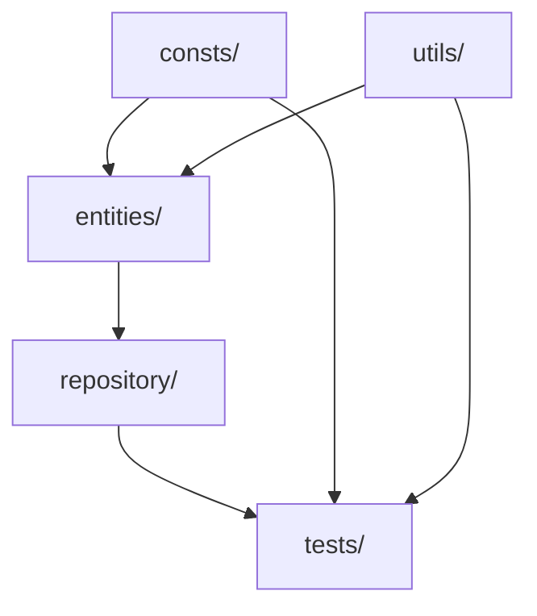

# Sistema de Pontuação de Clientes — TDD, Node.js & Vitest

Este projeto implementa um sistema de gerenciamento de pontos de fidelidade para clientes, focado em qualidade de software com TDD — Test Driven Development. O objetivo principal é permitir a prática de TDD aplicando testes à camada de negócio, utilizando arquitetura Repository Pattern simplificada, e operando apenas com dados em memória (sem banco de dados ou interface gráfica).

## Contexto

Uma empresa precisa de um sistema para calcular e gerenciar pontos de fidelidade dos clientes, conforme regras que podem evoluir. Pontos são acumulados com base em compras, podendo receber bônus ou descontos conforme o perfil do cliente.

## Objetivos

- **Praticar TDD:** Testes devem ser escritos antes da implementação de cada método.
- **Desenvolver métodos testáveis:** Foco na lógica de negócio e manipulação em memória.
- **Manutenção e refatoração seguras:** Garantidas por testes automatizados.

## Tecnologias e Requisitos

- **Node.js v22**
- **Vitest / Vitest UI** (testes automatizados)
- \*_Sem banco de dados — apenas estruturas de dados_

## Comandos Básicos e Como Rodar

- **Instalar dependências:** `npm install`
- **Executar testes:** `npm run test`
- **Executar testes com interface gráfica (Vitest UI):** `npm run test:ui`
- **Executar cobertura de testes:** `npm run coverage`
- **Executar cobertura de testes com interface gráfica:** `npm run coverage:ui`

## Estrutura do Projeto

A arquitetura foi organizada à luz de um **DDD enxuto**, priorizando a separação de responsabilidades e a rastreabilidade das regras de negócio. A ideia é que qualquer nova regra se concentre primeiro na camada de domínio (`entities`), seja orquestrada pelo repositório e validada pelos testes.

```bash
sistema-de-fedelidade/
├── package.json
├── README.md
├── vitest.config.js
└── src/
    ├── consts/          # Léxico do domínio (tipos, multiplicadores, limites)
    ├── entities/        # Modelos de domínio: Cliente agrega Carteira
    ├── repository/      # Padrão Repository para orquestrar coleções em memória
    ├── utils/           # Funções puras de validação e cálculo
    └── tests/           # Testes unitários (23 oficiais + extras de exceções)
```

Fluxo de dependência (camadas externas apontam para o domínio):



Componentes principais:

- **`src/entities/`** — Núcleo do domínio. `Cliente` agrega `Carteira`, mantendo baixo acoplamento e permitindo evolução independente das regras de pontuação e das operações de carteira.
- **`src/repository/`** — Implementa o padrão Repository. O `ClienteRepository` abstrai a persistência (in-memory), centraliza buscas, filtros, ordenações e mantém as coleções consistentes usando as próprias entidades.
- **`src/utils/`** — Funções puras (cálculos e validações) compartilhadas entre entidades e repositório para sustentar o princípio de responsabilidade única.
- **`src/consts/`** — Catálogo de elementos estáticos do domínio (tipos de cliente, multiplicadores, pontos de boas-vindas). Serve como “ubiquitous language” do projeto.
- **`src/tests/`** — Suíte completa de testes unitários organizada por caso de uso. Todos os 23 testes obrigatórios foram isolados em arquivos individuais numerados, e arquivos extras cobrem cenários de exceção e regressões.

## Regras Básicas de Pontuação

- Cliente padrão: 1 ponto por real gasto.
- Cliente Premium: 1,5 ponto por real gasto.
- Cliente VIP: 2 pontos por real gasto.

## Funcionalidades Principais

- Registrar uma compra (acumula pontos)
- Consultar total de pontos
- Resgatar pontos por descontos (1 ponto = R$0,05)
- Operar sobre listas de clientes (adicionar, filtrar, ordenar, remover)

## Entregáveis

- Código-fonte completo da aplicação
- Testes unitários cobrindo regras e operações em listas
- Relatório breve (máx. 4 páginas) resumindo estratégia de TDD, casos de teste e cobertura
- README completo e instrutivo

## Critérios de Avaliação

| Critério                 | Peso (%) |
| ------------------------ | -------- |
| Aplicação correta do TDD | 30       |
| Qualidade dos testes     | 25       |
| Coerência da lógica      | 25       |
| Organização do código    | 10       |
| Documentação e relatório | 10       |

---

## Checklist de Tarefas — 4 Semanas

- [x] Setup do projeto Node.js v22, Vitest/UI, configurações básicas (`app.js`, dependências)
- [x] Implementar estrutura de pastas e arquivos básicos
- [x] Definir tipos de cliente, regras e permissões (`consts`, `database`)
- [x] Criar as estruturas em memória (listas, objetos de clientes)
- [x] Escrever testes TDD para regras básica de pontos
- [x] Implementar métodos de cálculo
- [x] Testar consultas e operações em listas (adicionar/filtrar/ordenar/remover)
- [x] Escrever testes de resgate de pontos e bonificações
- [x] Validar tratamento de exceções: clientes inexistentes, saldo insuficiente, valores inválidos
- [x] Refatoração baseada nos testes — de acordo com TDD
- [x] Checklist de casos de teste (ver lista abaixo)
- [ ] Preparar relatório e cobertura de testes
- [ ] Revisão final do código e documentação

### Estimativa de Tempo

| Semana | Macro-atividades                                  | % do Projeto |
| ------ | ------------------------------------------------- | ------------ |
| 1      | Setup inicial, arquitetura, tipos, testes simples | 20           |
| 2      | Métodos de cálculo, streams, TDD nas regras       | 30           |
| 3      | Operações em listas, resgate de pontos            | 30           |
| 4      | Testes avançados, refatoração, relatório, revisão | 20           |

---

### Checklist de Testes Unitários

- [x] **1. test_calcular_pontos_compra_cliente_padrao()**  
       Verificar se o cliente padrão recebe 1 ponto por real gasto
 
- [x] **2. test_calcular_pontos_cliente_premium()**  
       Confirmar que clientes Premium recebem 1,5 ponto por real gasto

- [x] **3. test_calcular_pontos_cliente_vip()**  
       Validar que clientes VIP recebem 2 pontos por real gasto

- [x] **4. test_acumular_pontos_varias_compras()**  
       Testar o acúmulo de pontos em várias compras consecutivas

- [x] **5. test_consultar_pontos_cliente_existente()**  
       Verificar se a consulta retorna o total correto de pontos

- [x] **6. test_resgatar_pontos_para_desconto()**  
       Garantir que o resgate de pontos gere o desconto correto

- [x] **7. test_impedir_resgate_com_saldo_insuficiente()**  
       Certificar que o cliente não possa resgatar mais pontos do que possui

- [x] **8. test_resgatar_todos_os_pontos_disponiveis()**  
       Validar que o sistema permita resgatar todo o saldo disponível

- [x] **9. test_nao_gerar_pontos_para_valor_zero()**  
       Assegurar que compras de valor zero não gerem pontos

- [x] **10. test_gerar_pontos_para_valores_decimais()**  
       Confirmar que valores decimais geram pontos proporcionais

- [x] **11. test_nao_permitir_pontos_negativos()**  
       Garantir que o saldo de pontos nunca seja negativo

- [x] **12. test_cliente_inexistente_lanca_excecao()**  
       Verificar se o sistema retorna null ao buscar cliente inexistente

- [x] **13. test_registrar_novo_cliente_com_pontos_iniciais()**  
       Validar o cadastro de um cliente com pontos de boas-vindas

- [x] **14. test_aplicar_bonus_promocional_em_compra()**  
       Testar aplicação de bônus promocional sobre compras

- [x] **15. test_expirar_pontos_antigos_apos_periodo()**  
       Simular expiração de pontos antigos após período determinado

- [x] **16. test_registrar_varios_clientes_em_lista()**  
       Validar a inserção de múltiplos clientes em uma lista

- [x] **17. test_calcular_pontos_lista_clientes()**  
       Calcular pontos para todos os clientes de uma lista

- [x] **18. test_filtrar_clientes_com_pontos_acima_de_limite()**  
       Filtrar clientes cujo saldo de pontos é superior a determinado valor

- [x] **19. test_ordenar_clientes_por_pontos()**  
       Ordenar clientes conforme o total de pontos acumulados

- [x] **20. test_remover_clientes_com_saldo_zero()**  
       Remover da lista os clientes que possuem saldo de pontos igual a zero

- [x] **21. test_buscar_cliente_por_nome()**  
       Pesquisar cliente pelo nome em uma lista de clientes

- [x] **22. test_somar_total_pontos_lista()**  
       Calcular o total de pontos de todos os clientes da lista

- [x] **23. test_ranking_clientes_por_pontos()**  
       Gerar ranking dos clientes ordenado por pontuação decrescente

**Status**: ✅ Todos os 23 testes obrigatórios implementados e passando. Cobertura de código: **100%**.


---

## Extensões Opcionais

- Novos tipos de cliente (Bronze, Prata, Ouro)
- Regras mais avançadas de expiração de pontos
- Operações dinâmicas sobre listas (ranking, busca avançada, merge)
- Expansão do sistema mantendo TDD e arquitetura modular
