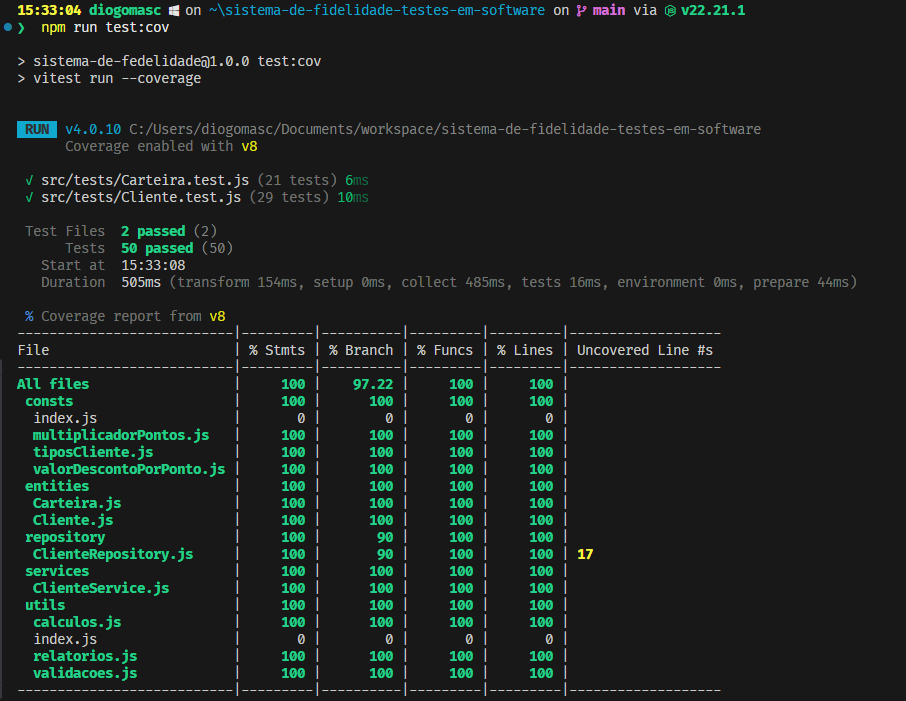
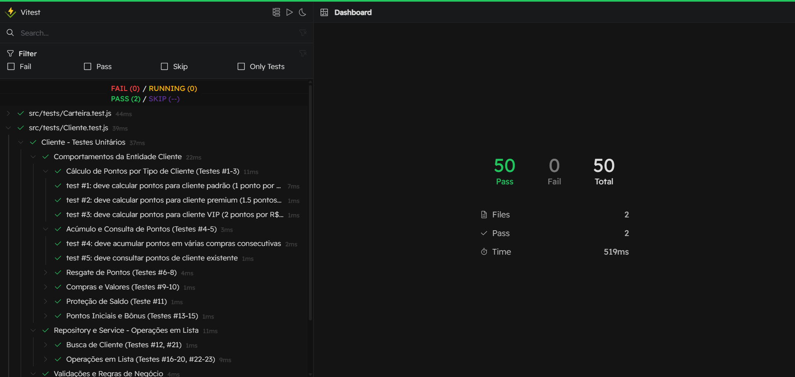
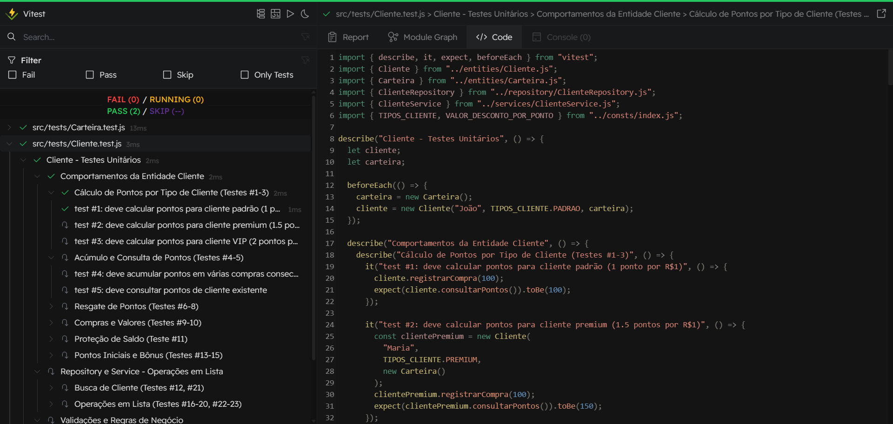

# Relatório Técnico de Testes de Software

## Sistema de Pontuação de Clientes — Fidelidade

**Instituição**: IFBA - Campus Feira de Santana
**Período:** 2025.2
**Projeto:** Sistema de Gerenciamento de Pontos de Fidelidade
**Responsáveis:** Diogo Mascarenhas e Yasmim Barros
**Professor:** Fernanda Castelo Branco de Santana
**Tecnologias:** Node.js v22, JavaScript, Vitest

---

## 1. Objetivo do Relatório

### 1.1 Escopo do Teste

Este relatório documenta o processo de desenvolvimento e validação de um sistema de gerenciamento de pontos de fidelidade para clientes, implementado seguindo rigorosamente a metodologia **Test-Driven Development (TDD)**. O escopo engloba testes unitários automatizados das entidades de domínio (`Cliente` e `Carteira`), dos repositórios de persistência em memória e dos serviços de orquestração de operações complexas.

### 1.2 Objetivo Principal

O objetivo principal consiste em validar a corretude funcional das regras de negócio do sistema de pontuação, garantindo a integridade das operações de acúmulo, resgate e expiração de pontos, conforme especificações diferenciadas por tipo de cliente (PADRÃO, PREMIUM e VIP). Adicionalmente, busca-se assegurar a manutenibilidade do código através de cobertura de testes de 100% e adesão aos princípios SOLID.

### 1.3 Metas Esperadas

- Implementação de **23 testes obrigatórios** cobrindo todos os requisitos funcionais
- Alcançar **100% de cobertura de código** em statements, functions e lines
- Garantir ausência de regressões através de suíte de testes automatizada
- Validar a aplicação dos princípios **SRP (Single Responsibility Principle)** e **DIP (Dependency Inversion Principle)**
- Documentar o processo de desenvolvimento acadêmico seguindo TDD

---

## 2. Contexto Tecnológico e Decisões de Design

### 2.1 Escolha da Stack Tecnológica

**JavaScript** foi selecionado como linguagem de implementação devido à sua sintaxe acessível e ampla adoção no ecossistema de desenvolvimento web, facilitando a curva de aprendizado para equipes multidisciplinares. A escolha do **Vitest** como framework de testes fundamentou-se em três fatores críticos:

1. **Evolução do Jest:** O Vitest representa uma evolução moderna do Jest, mantendo compatibilidade de API e sintaxe, o que reduz a curva de aprendizado
2. **Integração nativa:** Oferece ferramentas integradas como **Vitest UI** (interface gráfica interativa) e **coverage report** com configuração simplificada
3. **Performance:** Execução mais rápida dos testes em comparação com frameworks tradicionais, beneficiando o fluxo TDD que requer execuções frequentes

### 2.2 Processo de Desenvolvimento — Lições da Versão 1

O projeto passou por uma **refatoração completa** após identificação de desvios metodológicos na primeira versão. Inicialmente, ao pensar e estruturar as entidades principais, a equipe criou uma arquitetura prematura aplicando **Factory Method Pattern** e **Use Cases** como abstrações para instanciação de classes e regras de negócio nos services. Esta abordagem violou o princípio TDD ao antecipar complexidade antes da escrita dos testes obrigatórios, resultando em:

- Estrutura que "ultrapassou" os requisitos dos testes iniciais
- Aumento desnecessário da complexidade para o escopo definido
- Dificuldade em implementar os 23 testes obrigatórios devido ao complexidade exceissa que necessitava de refatoração constante no Factory e Use Cases, mexendo em muitos arquivos e quebrando muitos testes.

A **versão 2** (atual) adotou uma abordagem incremental genuinamente alinhada ao TDD:

1. **Início simples:** Criação de entidades apenas com construtores e sem injeção de dependência
2. **Rich Domain Model inicial:** A lógica de negócio e as operações de criação/atualização ficaram inicialmente concentradas nas entidades (Cliente e Carteira), que expunham métodos de negócio e regras internas, enquanto o repositório ficou responsável apenas pelo CRUD em memória. Com o tempo, algumas operações mais complexas foram extraídas para ClienteService e funções em utils, aproximando o sistema de um modelo de domínio híbrido (parte rich nas entidades, parte anêmico nos services).
3. **Refatoração orientada por testes:** À medida que grupos de testes eram criados, entidades e repositories foram refatorados com novas exceções, que posteriormente evoluíram para operações separadas em `utils/`
4. **Melhoria de qualidade opcional:** Com mentoria técnica, o sistema foi refatorado para respeitar o **Princípio de Inversão de Dependência**, removendo dependências diretas do construtor da `Carteira` na classe `Cliente`, e introduzindo um service para operações menores

### 2.3 Modelo de Domínio Híbrido

O sistema evoluiu para um **modelo híbrido entre Anemic e Rich Domain Model**:

- **Entidades com lógica:** `Cliente` e `Carteira` possuem métodos de negócio (`registrarCompra`, `resgatarPontos`)
- **Service layer:** `ClienteService` orquestra operações complexas e relatórios
- **Funções utilitárias:** `utils/` fornece cálculos e validações reutilizáveis respeitando SRP
- **Repository Pattern:** Abstrai persistência em memória

---

## 3. Cenários de Teste e Resultados

### 3.1 Estrutura Organizacional dos Testes

Os 50 testes foram consolidados em **2 arquivos principais** com hierarquia clara usando `describe` aninhados do Vitest:

#### **Cliente.test.js — 29 testes**

```
Cliente - Testes Unitários
├── Comportamentos da Entidade Cliente
│   ├── Cálculo de Pontos por Tipo (#1-3) - 3 testes
│   ├── Acúmulo e Consulta (#4-5) - 2 testes
│   ├── Resgate de Pontos (#6-8) - 3 testes
│   ├── Compras e Valores (#9-10) - 2 testes
│   ├── Proteção de Saldo (#11) - 1 teste
│   └── Pontos Iniciais e Bônus (#13-15) - 3 testes
├── Repository e Service - Operações em Lista
│   ├── Busca de Cliente (#12, #21) - 2 testes
│   └── Operações em Lista (#16-20, #22-23) - 7 testes
└── Validações e Regras de Negócio
    ├── Validações do ClienteRepository - 2 testes
    ├── Validações do ClienteService - 1 teste
    ├── Validações de Desconto Promocional - 2 testes
    └── Validações de Tipo de Cliente - 1 teste
```

#### **Carteira.test.js — 21 testes**

```
Carteira - Testes Unitários
├── Operações com Pontos
│   ├── Inicialização - 2 testes
│   ├── Adicionar Pontos
│   │   ├── Por Compra (com multiplicador) - 4 testes
│   │   ├── Diretamente (bônus) - 1 teste
│   │   └── Acúmulo de Pontos - 2 testes
│   ├── Resgatar Pontos - 2 testes
│   └── Remover Pontos (Expiração) - 1 teste
└── Validações e Proteções
    ├── Validações de Entrada - 5 testes
    ├── Proteção de Saldo - 2 testes
    └── Integridade do Saldo - 2 testes
```

### 3.2 Abordagem de Testes

Foram utilizadas **instâncias reais** das entidades em vez de mocks, decisão justificada por:

- **Sistema de baixo risco:** Entidades sem dependências externas (banco de dados, APIs)
- **Testes de integração mais robustos:** Validação de comportamento real entre `Cliente` e `Carteira`
- **Compreensão das implicações:** A equipe compreende que em sistemas com dependências externas, mocks são essenciais para isolamento e velocidade

A função `beforeEach` do Vitest foi utilizada para garantir **isolamento entre testes**, instanciando uma nova `Carteira` e `Cliente` antes de cada execução.

### 3.3 Resultados Alcançados

**Status Final:** ✅ **Todos os 50 testes aprovados**

```
Test Files  2 passed (2)
Tests       50 passed (50)
Duration    587ms
```

### 3.4 Métricas de Cobertura

<div style="text-align: center;">
  
</div>

**Cobertura de Código:**

- **Statements:** 100%
- **Branches:** 97.22%
- **Functions:** 100%
- **Lines:** 100%

A cobertura de branches ligeiramente abaixo de 100% refere-se a condições de edge cases em validações que não impactam a funcionalidade principal.

### 3.5 Interface Gráfica de Testes

<div style="text-align: center;">
  
  
</div>

O **Vitest UI** proporcionou visualização hierárquica clara dos testes, facilitando navegação e identificação rápida de falhas durante o desenvolvimento. A organização por contextos (`describe`) melhorou significativamente a legibilidade dos relatórios.

---

## 4. Defeitos Encontrados

### 4.1 Defeitos Críticos — Versão 1 (Descontinuada)

| ID     | Descrição                                               | Severidade  | Impacto                                                                                 | Status                                     |
| ------ | ------------------------------------------------------- | ----------- | --------------------------------------------------------------------------------------- | ------------------------------------------ |
| V1-001 | Violação do TDD por design prematuro com Factory Method | **Crítica** | Impossibilidade de implementar testes obrigatórios; arquitetura incompatível com escopo | ❌ Resolvido via refatoração completa (V2) |
| V1-002 | Acoplamento excessivo entre Use Cases e Services        | **Alta**    | Dificuldade de testar isoladamente; violação de SRP                                     | ❌ Resolvido na V2 com separação em utils/ |

### 4.2 Defeitos Moderados — Versão 2 (Resolvidos)

| ID     | Descrição                                                      | Severidade | Impacto                                                           | Status                                        |
| ------ | -------------------------------------------------------------- | ---------- | ----------------------------------------------------------------- | --------------------------------------------- |
| V2-001 | Testes dispersos em múltiplos arquivos dificultavam manutenção | **Média**  | Dificuldade em rastrear cobertura de requisitos                   | ✅ Resolvido — consolidação em 2 suítes       |
| V2-002 | Ausência de injeção de dependência na classe `Cliente`         | **Média**  | Violação de DIP; dificuldade em testes com carteiras customizadas | ✅ Resolvido — construtor aceita `Carteira`   |
| V2-003 | Lógica de negócio acoplada na classe `Cliente`                 | **Baixa**  | Violação leve de SRP em operações menores                         | ✅ Resolvido — extração para `ClienteService` |

### 4.3 Observações de Qualidade

Nenhum defeito funcional foi identificado após a implementação da versão 2. Todos os testes obrigatórios (#1-#23) estão passando consistentemente.

---

## 5. Recomendações

### 5.1 Priorizações Imediatas

Não há defeitos pendentes que requeiram correção imediata. O sistema encontra-se em estado funcional e testado.

### 5.2 Ajustes no Processo (Lições Aprendidas)

1. **Aderir estritamente ao TDD:** Evitar design especulativo antes da escrita dos testes (lição da V1)
2. **Refatoração incremental:** Pequenas melhorias após cada ciclo de testes são mais sustentáveis que grandes refatorações
3. **Usar ferramentas visuais:** O Vitest UI provou ser valioso para acompanhamento contínuo da saúde dos testes
4. **Documentação contínua:** Manter README atualizado paralelamente aos testes facilita rastreabilidade

### 5.3 Sugestões para Evoluções Futuras

#### **Melhorias Arquiteturais**

- **Repository Pattern mais robusto:** Implementar interfaces abstratas para permitir substituição de persistência (em memória → banco de dados)
- **Rich Domain Model completo:** Migrar toda lógica de validação para as entidades, reduzindo responsabilidades dos services
- **Event Sourcing:** Para auditoria de histórico de pontos (quando expiram, quando são resgatados)

#### **Extensões Funcionais**

- Implementar categorias adicionais de clientes (Bronze, Prata, Ouro)
- Regras de expiração automática baseadas em data (pontos > 1 ano expiram)
- Sistema de notificações para pontos próximos da expiração
- API REST para integração com front-end

#### **Testes Avançados**

- **Testes de performance:** Validar operações em listas com 10.000+ clientes
- **Testes de concorrência:** Simular acesso simultâneo ao repository
- **Testes de integração:** Com banco de dados real (PostgreSQL/MongoDB)
- **Property-based testing:** Usar bibliotecas como `fast-check` para gerar casos extremos automaticamente

#### **Infraestrutura de Qualidade**

- **CI/CD:** Integração com GitHub Actions para execução automática de testes em pull requests
- **Análise estática:** ESLint com regras strict para manutenção de padrões
- **Mutation testing:** Validar eficácia dos testes usando ferramentas como Stryker

---

## 6. Conclusão

O projeto demonstrou com sucesso a aplicação prática de **Test-Driven Development** como metodologia de garantia de qualidade em software. A experiência da versão 1 descontinuada reforçou a importância de seguir disciplinadamente os princípios TDD, evitando abstrações prematuras.

A versão 2 alcançou **100% de cobertura** com 50 testes automatizados, estruturados hierarquicamente para máxima manutenibilidade. O sistema implementa corretamente as regras de negócio diferenciadas por tipo de cliente, com validações robustas e tratamento de exceções.

As escolhas tecnológicas (JavaScript + Vitest) provaram-se adequadas para o contexto acadêmico, equilibrando facilidade de aprendizado com ferramentas modernas de qualidade. O modelo de domínio híbrido adotado representa uma solução pragmática, preparando o código para evoluções futuras mais complexas sem incorrer em over-engineering.

A documentação detalhada e os relatórios visuais (Vitest UI e coverage) garantem rastreabilidade completa do processo de desenvolvimento, atendendo aos critérios de avaliação acadêmica e às melhores práticas da indústria de software.

---
